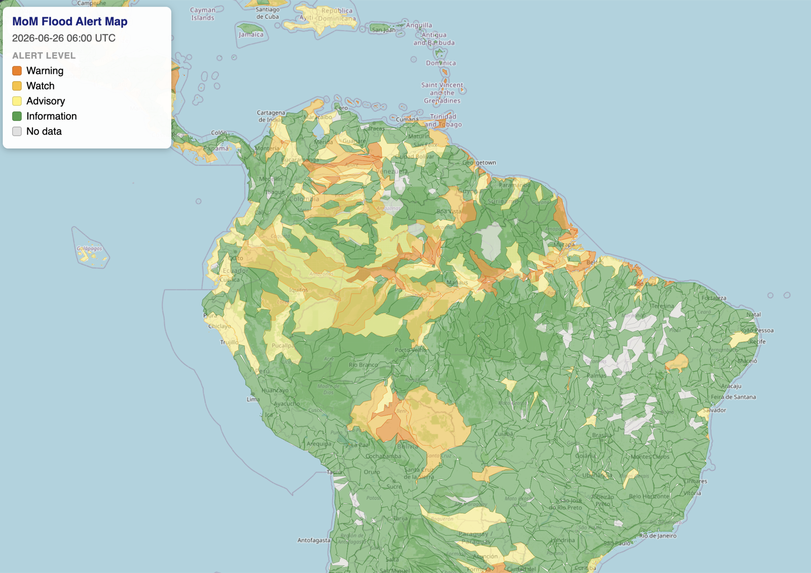

# MoM Map Viewer — Setup

Interactive flood alert map: watershed polygons colored by alert level, served as PMTiles, alert data fetched in real time.

**Live:** [mom-map.blu-h.org](https://mom-map.blu-h.org)



## GitHub Pages (serverless)

> **Requirement:** GitHub Pages for private repos requires **GitHub Pro** (personal) or **GitHub Team / Enterprise** (org). Free plans only support public repos.

### How it works

```
GitHub Action (01:30, 06:30, 13:30, 18:30 UTC)
    ↓ checks for new Final_Attributes CSV
    ↓ joins with shapefile via GDAL
    → gh-pages branch: index.html + data/watersheds.pmtiles + data/metadata.json

Browser → GitHub Pages (CDN)
    ├── /           → index.html (map.html)
    └── /data/      → watersheds.pmtiles + metadata.json
```

### Setup

**1. Enable GitHub Pages**

Repo → **Settings → Pages**:
- Source: **Deploy from a branch**
- Branch: `gh-pages` / `/ (root)`

(The `gh-pages` branch is created automatically on the first Action run.)

**2. Add the workflow**

Keep `.github/workflows/update-tiles.yml`. No edits needed.

**3. Trigger the first run**

**Actions → Update map tiles → Run workflow**. This generates the initial tiles and creates the `gh-pages` branch.

**4. Find your URL**

After the first deploy, **Settings → Pages** shows the public URL:
`https://<owner>.github.io/<repo>/`

## Local development (Windows)

**Step 1 — set up venv calling .\setup.ps1:**

**Step 3 - create .env file with MOM_CSV_URL=...**

**Step 2 — generate tiles:**

```powershell
python update_tiles.py --once
```

**Step 3 — serve the map:**

```powershell
python serve.py
```

Open `http://localhost:8080/map.html`.

> `python -m http.server` does **not** work — PMTiles requires HTTP Range requests, which Python's built-in server doesn't support. `serve.py` handles this with no extra dependencies.

**Step 3 — watch for CSV updates** (optional, regularly):

```powershell
python update_tiles.py
```
